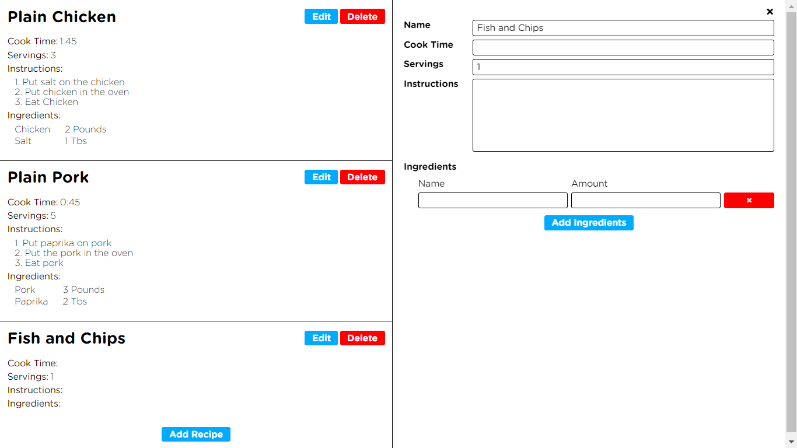

<h1 align=center>React Recipe Book</h1>
<h2 align=center><a href="">DEMO</a></h2>

## LESSONS LEARNED

- used `UUID` package for Random Id's
  (`npm i uuid` and `import { v4 as uuidv4 } from 'uuid';`)
- LocalStorage used for persistent state.
